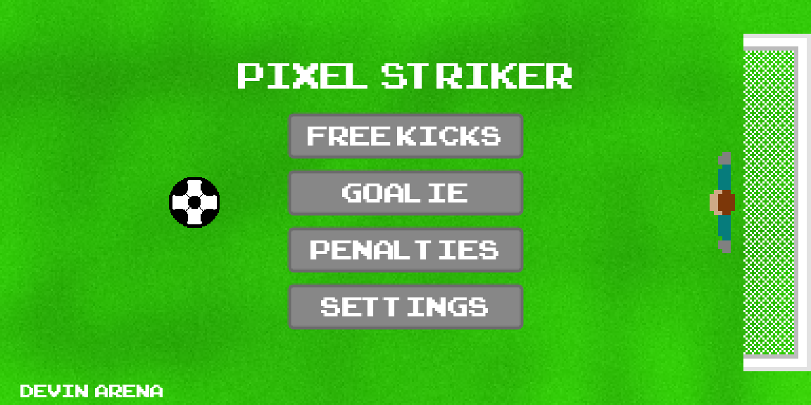
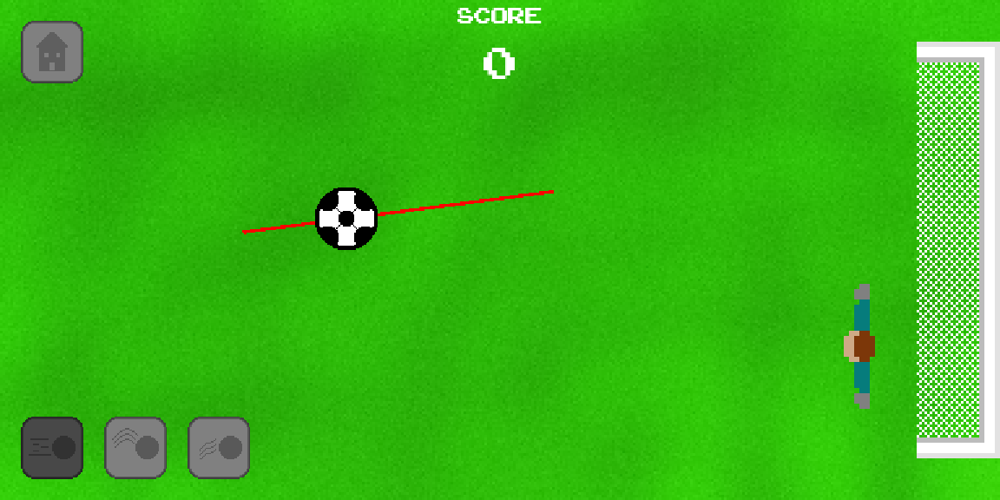
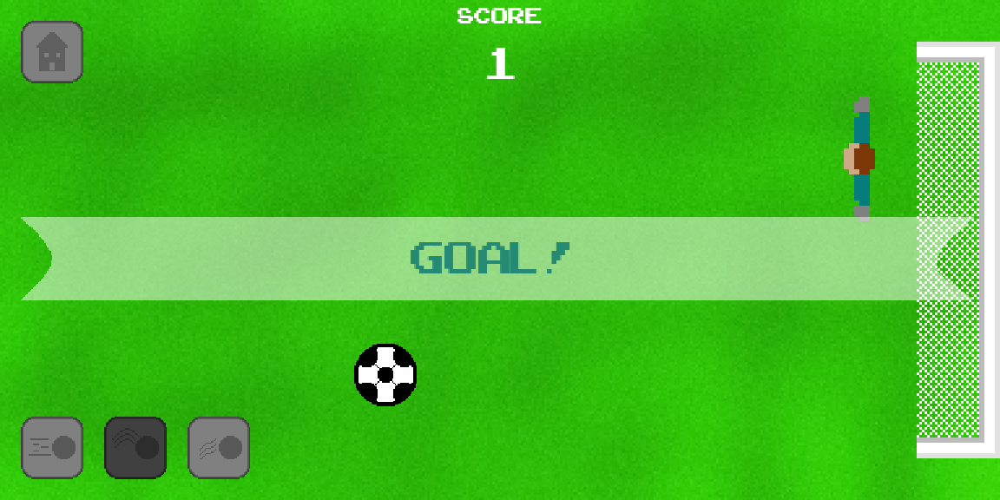
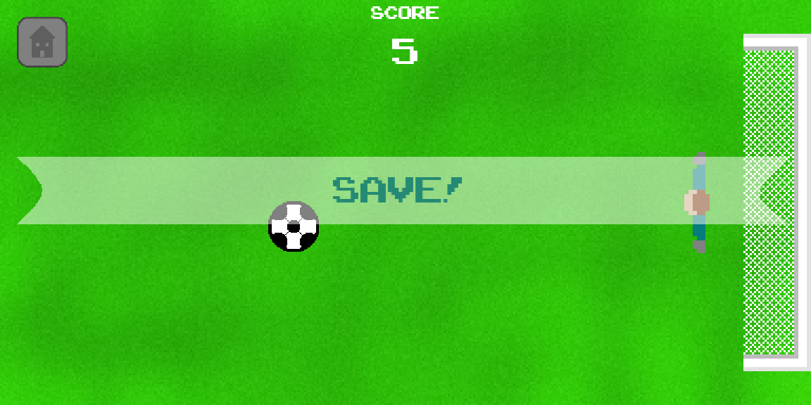
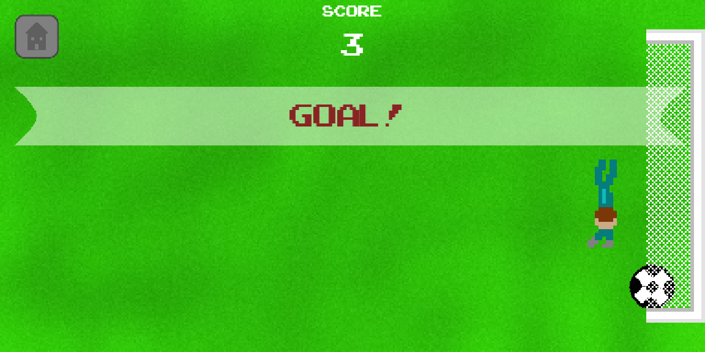

# Pixel Striker
A soccer mobile game developed using the Godot game engine. Play through multiple game modes and make your way to the top of the leaderboards!

This application does not contain advertisements or in-game purchases for the sake of it being open source.

# Gameplay
The game currently has 3 select gamemodes, free kicks, goalie, and penalties. Each is unique in its gameplay and controls.

## Free Kicks
The ball and the goalie are positioned randomly on the map, your objective is to attempt to score through aiming away from the goalie. The goalie will always dive in the direction the ball is moving in an attempt to save.
## Penalties
The ball and the goalie are positioned in the same position every time. The goalie will choose a random direction and speed to dive in and you must predict and aim the ball away from this area.
## Goalie
In this gamemode, the ball is positioned randomly and you are always positioned in the same spot. The ball is struck after ~1 second and you must swipe to attempt to dive and save the ball.

# Features
Includes user preferences and integration to Google Play Game Services. Contains 6 unique achievements (2 for each gamemode) and 3 leaderboards (1 for each gamemode).

# Getting Started
This app is available on the Google Play Store:

# Images

  
  
  
  
  
  
  
  
  
  
  

# License
This code is published under the MIT License. You are free to use it as you wish.
